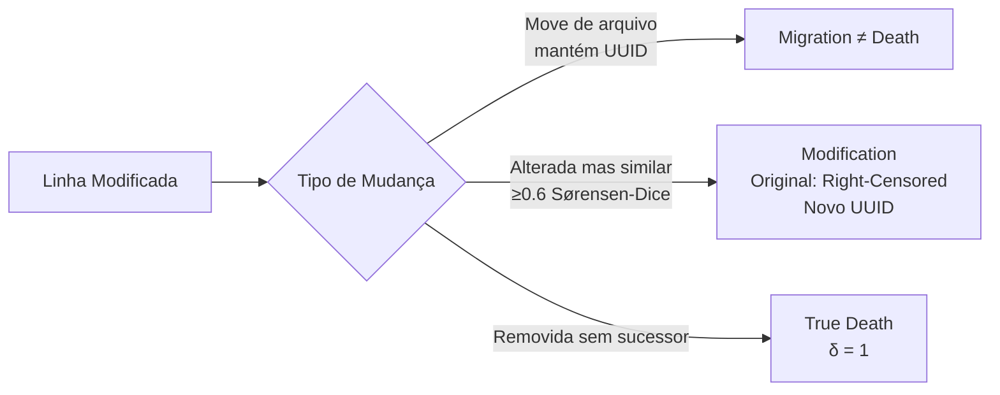

# 📜 CLSA — Code Lifespan Survival Analysis (Gurov 2026)

<div class="card-grid">
  <div class="card">
    <h3>📄 Paper</h3>
    <div class="card-meta"><a href="https://arxiv.org/abs/2606.04993" target="_blank" rel="noopener">arXiv:2606.04993v3</a> · Jun 2026 · cs.SE</div>
    <p>Primeiro framework a modelar risco de deleção de linhas individuais com Cox PH.</p>
    <div class="card-tags">
      <span class="card-tag">Cox PH</span>
      <span class="card-tag">AST-aware</span>
      <span class="card-tag">32.5M eventos</span>
      <span class="card-tag">TypeScript</span>
    </div>
  </div>
</div>

---

## Por que Este Paper é a Base do TCC

O CLSA é o **único trabalho rigoroso** de análise de sobrevivência de código. Ele estabelece:

1. **Definições operacionais** exatas de birth, death, censoring para artefatos VCS-tracked
2. **Pipeline de matching** de 5 estágios que separa refactoring de true death
3. **Metodologia estatística** completa: Cox PH → Schoenfeld → landmark → frailty → AFT
4. **15 covariates** testadas com interpretabilidade

O TCC **adapta** esta metodologia de line-level para **macro-level** (APIs, dependências, IaC).

---

## Definições Operacionais (Seção 3 do LaTeX)

### Line as a Survival Subject

```
Birth time (t_i^b): Commit timestamp da primeira aparição natural
Death time (t_i^d): Commit de remoção permanente
Observed duration: T_i = min(t_i^d - t_i^b, C - t_i^b)
Event indicator: δ_i = 1[t_i^d ≤ C]
Censoring: 66.1% (maioria das linhas nunca deletadas)
```

### 3 Topologias de Mudança



---

## Pipeline de Coleta (Seção 5)

### 5-Stage Matching Pipeline

| Estágio | Descrição | Threshold |
|---------|-----------|-----------|
| **1. Exact Structural Match** | String exata + mesmo AST type, mesmo arquivo | Exato |
| **2. Global Structural Match** | String exata + mesmo AST type, qualquer arquivo | Exato |
| **3. Linear Sum Assignment** | Hungarian algorithm, Sørensen-Dice (70%) + Ratcliff/Obershelp (30%) | ≥0.6 |
| **4. Cross-File Similarity** | AST-aware, pares entre arquivos diferentes | ≥0.6 |
| **5. Intra-File AST-Agnostic** | Sem restrição AST, alta confiança | ≥0.9 |

### Covariates (15 total)

| # | Covariate | Tipo | Descrição |
|---|-----------|------|-----------|
| 1 | AST node type | Categórica | declaration, expression, control_flow, etc. |
| 2 | Nesting depth | Contínua | Contagem de scope-creating ancestors |
| 3 | in_loop | Binária | Dentro de for/while/do |
| 4 | in_condition | Binária | Dentro de if/switch/ternary |
| 5 | in_try_catch | Binária | Dentro de try/catch/finally |
| 6 | in_function | Binária | Dentro de function/arrow/method |
| 7 | log_tokens | Contínua | ln(1 + token_count) |
| 8 | log_todo_distance | Contínua | Distância ao TODO/FIXME mais próximo |
| 9 | Commit hour | Contínua | Hora do dia (0-23) |
| 10 | Commit weekday | Binária | Dia útil vs fim de semana |
| 11 | File age | Contínua | Idade do arquivo no birth |
| 12 | File churn | Contínua | Taxa de mudança do arquivo |
| 13 | Repository age | Contínua | Idade do repositório |
| 14 | Author experience | Contínua | Commits prévios do autor |
| 15 | Repository identity | Gamma frailty | Random effect |

---

## Resultados Principais

### RQ1: Baseline Survival

| Métrica | Valor |
|---------|-------|
| Linhas nunca deletadas | >50% (KM median não alcançado) |
| Mediana das deletadas | 95.7 dias |
| Censoring | 66.1% |

### RQ5: Cox PH Multivariado

| Covariate | Hazard Ratio | Interpretação |
|-----------|-------------|---------------|
| log_tokens | **0.80** | Linhas mais longas → 20% menos risco |
| in_condition (0-90d) | 0.98 | Protetivo no início |
| in_condition (90d+) | **1.21** | Fator de risco após 90 dias |
| Repository frailty (theta) | **1.208** | Identity é o maior fator |

### Concordance

| Modelo | Concordance |
|--------|-------------|
| Cox PH (sem frailty) | 0.593 |
| Cox PH + Gamma Frailty | **0.667** |

---

## Adaptação para o TCC (Macro-Artefatos)

| CLSA (Line-Level) | TCC (Macro-Level) |
|-------------------|-------------------|
| Linha de código | Endpoint REST (path + method) |
| AST node type | HTTP method (GET/POST/PUT/DELETE) |
| Nesting depth | Path depth (segmentos) |
| in_condition / in_loop | Has deprecation marker |
| log_tokens | Parameter count / Response type count |
| File age | API age at endpoint birth |
| Repository identity | API provider identity |
| 5-stage AST matching | 3-stage path+semantic matching |
| 32.5M eventos | ~108K endpoints |

## Limitações Conhecidas

1. **PH assumption violada:** Efeitos time-varying em 3 regimes → requer landmark models
2. **Apenas TypeScript:** Generalização para outras linguagens não testada
3. **66.1% censoring:** Muitas linhas nunca morrem → pode enfraquecer poder estatístico
4. **Complexidade do pipeline:** 5 estágios + ClickHouse + 9 tabelas — simplificável para macro