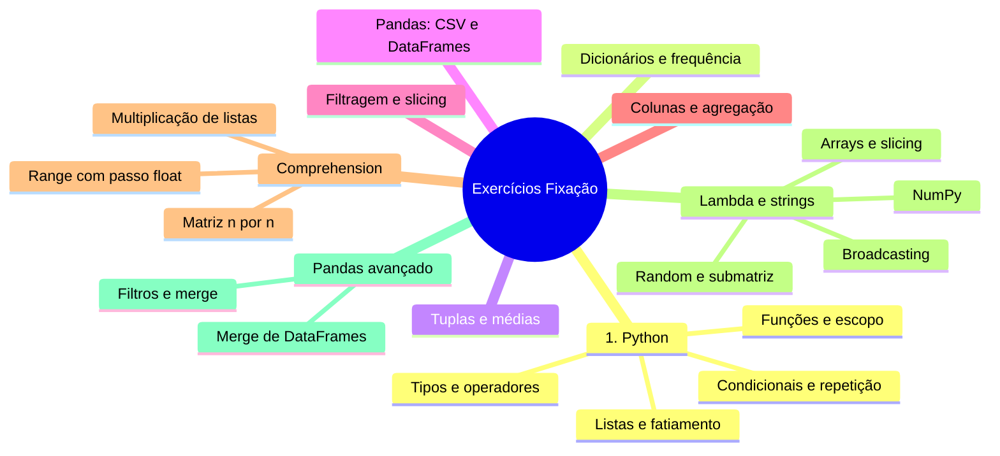

# Exercícios de Fixação — Curso 01 (Python + SQL)

> Conhecimento destilado dos exercícios de fixação do curso. Cada exercício exercita conceitos específicos — use como checklist de domínio.

## Mapa de conceitos por exercício



## Exercícios

### Exercício 1 — Tipos de dados, operadores aritméticos e booleanos

Qual o tipo do valor resultante das operações abaixo (ou das variáveis as quais foram atribuídos)?

a) `False + True`
b) `2 * 1e2**2`
c) `a = 6/2`
d) `x = 6//2 + 6%2`
e) `(2 + 4) == 4 or 0

### Exercício 2 — Operador módulo (%), condicionais, ano bissexto

Crie uma variável contendo um ano (um valor inteiro entre 0 e 3000)

A seguir, se o ano for divisível por 4, exiba na tela 'Pode ser um ano bissexto'; caso contrário exiba 'Definitivamente não é um ano bissexto'

__Dica:__ Utilize o operador `%` que retorna o resto da divisão de um número por outro.

### Exercício 3 — Listas, filtragem por tipo (int/float)

Dada a lista `valores` abaixo, crie uma nova lista chamada `numeros` contendo apenas elementos `float` ou `int`.

Note que essa nova lista pode ter menos elementos do que a lista existente.

Ao final exiba a nova lista `numeros`

__Dica__: Percorra a lista com uma estrutura de repetição e utilize `type()` para retornar o tipo e compare com o desejado. Exemplo:

```python
type(3) == int

```

Retorna `True`

### Exercício 4 — Funções, juros compostos, estruturas de repetição

Escreva uma **função** que receba por parâmetro uma taxa de juros pagas ao ano, calcule e retorne um número inteiro relativo a quantos anos serão necessários para que um investimento nessa taxa dobre de valor. Assuma juros compostos e use uma estrutura de repetição para calcular.

### Exercício 5 — Fatiamento de listas, comprehension com filtro

Considere a lista `linguagens` declarada abaixo.

- Utilizando fatiamento, imprima o subconjunto de elementos entre o segundo e o quarto elemento (inclusive)
- Gere uma nova lista chamada `maiores4` contendo os elementos da lista `linguagens` que possuam quatro caracteres ou mais, utilizando a função `len()`.
- Gere uma nova lista chamada `j_ou_c` contendo os elementos da lista `linguagens` que começam com a letra 'j' ou com a letra 'c'.

### Exercício 6 — Funções, dicionários, contagem de frequência

Codifique uma função `conta_palavras()` que, a partir de um um texto (string) contendo palavras separadas por vírgulas apenas - considere que não há outras pontuações:

1. Inicie criando uma lista de palavras e
2. Use um dicionário para contar a frequência de cada palavra no texto, retornando o dicionário obtido.

*Dica: use a função `str.split()` para separar uma string em substrings usando como delimitador um caracter especificado por argumento*

Exemplo:

```
nomes = "ana,fábio,cristina,ana,fábio,ubiratã,ana"
freq = conta_palavras(nomes)
print(freq)

```

Deve gerar:

```
{'ana': 3, 'fábio': 2, 'cristina': 1, 'ubiratã': 1}

```

### Exercício 7 — Tuplas, listas aninhadas, média

Considere a lista `produtos` definida abaixo, onde cada elemento é uma tupla possuindo:

* elemento 1: o nome de um produto
* elemento 2: e uma lista de preços encontradas no mercado.

Calcule a média de preços de cada produto, salvando o resultado em uma nova lista chamada `preco_medio`.

Posteriormente, sorteie um dos produtos e exiba na tela o nome e preço médio desse produto sorteado

__Dica:__ Utilize a função `fsum()` do módulo `math` para somar os valores daa lista. Por exemplo:

```python
ls = [1.0,1.0,1.0,1.0,1.0]
print(fsum(ls))

```

resulta no valor 5
Os exercícios a seguir farão uso do arquivo WorldCups.csv

O arquivo WorldCups.csv possui as seguintes colunas:

- Year: ano da copa
- Country: pais sede
- Winner: campeão
- RunnersUp: disputou a final com o campeão
- Third: terceiro colocado
- Fourth: quarto colocado
- GoalsScored: número de gols na copa
- QualifiedTeams: número de times que disputaram a copa
- MatchesPlayed: número de jogos
- Attendance: número de espectadores (público)

### Exercício 8 — Pandas: leitura CSV, DataFrame, index, dtypes

Utilizando o pandas leia o arquivo WorldCups.csv como DataFrame.

- Definina a coluna 'Year' como índice
- Exiba as 5 primeiras linhas do DataFrame
- Exiba o tipo de dado de cada coluna
- Imprima o número de linhas do DataFrame

### Exercício 9 — Pandas: remoção de colunas, filtragem por intervalo

Remova as colunas 'QualifiedTeams' e 'Fourth' do DataFrame.

A seguir, com o DataFrame resultante, exiba os vencedores das copas entre os anos 1954 e 1982 (inclusive)

### Exercício 10 — Pandas: novas colunas, filtragem, agregação

Crie uma nova coluna com a média de gols por partida chamada `AverageGoalsMatch`, dividindo o número de gols pelo número de partidas jogadas.

A seguir, encontre e/ou calcule:

- os anos em que o Brasil ganhou a copa, armazene em uma lista e imprima na tela o ano e a média de gols naquele ano
- os anos em que o Brasil jogou uma final (os finalistas estão nas colunas 'Winner' e 'RunnersUp'), armazene em uma lista e imprima na tela
- a porcentagem de vitórias do Brasil em finais, e imprima na tela

### Exercício 11 — Comprehension, range com passo float, round()

Codifique uma função que use comprehension para retornar uma lista com `n` valores numéricos iniciando em 0 e  com passo `p` permitindo um número float como passo. Arredonde cada número para 5 casas decimais usando a função `round(,5)`

Exemplo para n=8, p=0.05

```
[0.0, 0.05, 0.1, 0.15, 0.2, 0.25, 0.3, 0.35, 0.4]

```

### Exercício 12 — NumPy/math: log, tratamento de zero (nan)

A partir de um vetor com números inteiros aleatórios, calcular seu `log` e criar uma lista com o resultado.

* se o número for 0 substituir o valor por `nan` (not a number) da biblioteca `math` para indicar que o resultado não é numérico

### Exercício 13 — Comprehension paralela, multiplicação elemento-a-elemento

Codifique uma função que receba como argumento duas listas de números com o mesmo tamanho. Use comprehension para retornar uma nova lista que é a multiplicação elemento-a-elemento das duas listas.  Caso as listas não possuam o mesmo tamanho emita uma mensagem de erro e retorne a constante `math.nan` do módulo `math`.

Exemplo:

```
l1 = [1, 2, 3, 4, 5]
l2 = [5, 5, 5, 10, 10]
multiplica_listas(l1,l2)

  [5, 10, 15, 40, 50]

```

### Exercício 14 — Comprehension aninhada, matriz n×n

Codifique uma comprehension que simule uma matriz de tamanho n x n, cujos elementos são dados por `(i+j*i)`, sendo `i` o índice da linha e `j` o índice da coluna. Para simular isso com uma lista de listas, o `i` corresponde ao índice da lista principal e o `j` aos índices das listas aninhadas.

Por exemplo, seja a segunda lista (posição i=1), o seu terceiro elemento (posição j=2) seria obtido por `1+2*1 = 3`

Exemplo com n = 3:

```
  [[0, 0, 0],
   [1, 2, 3],
   [2, 4, 6]]

```

---

## Desafio

Temos uma série de pontos 3D organizados numa lista e gostaríamos de computar as distâncias entre todos os pontos pareados.

Calcular a distância entre dois pontos $p1 = (x_1,y_1,z_1)$ e  $p2 = (x_2,y_2,z_2)$ usando a fórmula

$$d(p1,p2) = |x_1 - x_2| +|y_1 - y_2| + |z_1 - z_2|,$$
em que $|.|$ representa o valor absoluto.

Exemplo com 2 pontos organizados em listas:

```
[[1.0, 1.0, 1.0],
 [3.0, 3.0, 3.0]]

```

A saída deve ser:

```
[[0.0, 6.0],
 [6.0, 0.0]]

```

Note que a diagonal principal tem sempre valor zero já que representa a distância de um ponto para ele mesmo, e que a matriz é simétrica pois a distância entre dois pontos p1 e p2 é tal que: d(p1,p2) = d(p2,p1).

Para isso utilize uma única linha contendo comprehensions aninhadas e com iteração em paralelo

### Exercício 15 — Expressões lambda, manipulação de strings

Escreva uma expressão lambda que permita receber uma string contendo duas palavras relativas ao nome de uma pessoa e seu sobrenome. Essas são separadas por um ou mais espaços em branco. A expressão deve retornar o nome no formato: "SOBRENOME, N."

Exemplo:

```
nome = 'Dennis   ritchie'

```

Retorno:

```
RITCHIE, D.

```

A seguir escreva um comprehension que percorra uma lista contendo nomes e gere uma nova lista com os nomes no formato "SOBRENOME, N."

Exemplo:

```
nomes = ['Dennis   ritchie', 'ALAN  Turing', 'betty Holberton']

```

Retorno:

```
['RITCHIE, D.', 'TURING, A.', 'HOLBERTON, B.']

```

### Exercício 16 — NumPy: listas de tuplas → array 2D

Dada uma lista de tuplas, em que cada tupla é formada por um par (str,list). Ver um exemplo abaixo.

```
l_tup = [('a',[8, 4, 6, 1]), ('b',[1, 2, 3, 4]), ('c',[5, 3, 3, 3])]

```

* Converta a lista de tuplas em um numpy array bidimensional em que cada lista é transformada em uma linha do array, ignorando a string.
* Percorra cada linha do array resultante usando `for`, exibindo na tela os 3 últimos elementos de cada array

Seu código deve funcionar para qualquer número de tuplas na lista, assuma que as listas tem sempre o mesmo número de elementos, todos numéricos.

### Exercício 17 — NumPy: randint, slicing de submatriz, filtragem

Use o método `randint` do `np` para criar um array bidimensional com 6x10 elementos inteiros entre 1 e 5.

A seguir, considerando apenas a submatriz formada pelas linhas: 2 até 6 e as colunas 2, 5 e 8, copie para uma matriz unidimensional os valores maiores ou iguais a 4.

### Exercício 18 — NumPy: broadcasting, comparação entre arrays

Dados dois arrays conforme abaixo que são notas (de 1 a 10) dadas a 4 diferentes serviços fornecidos por empresas concorrentes A e B. As notas de cada serviço estão organizadas nas 4 linhas dos arrays.

A empresa `A` coletou 10 notas, e `B` coletou 5 notas para cada serviço (simuladas aleatoriamente no código abaixo).

Os 4 serviços possuem pesos que é determinado pela lista `pesos` listada abaixo.

A empresa A deseja se comparar com a empresa B com base na média das notas da empresa B. Para isso:

1. usando redução, obtenha a média das notas de cada serviço da empresa B;
2. para cada serviço, calcule qual foi a menor nota observada por A considerando apenas as notas de A que foram maiores do que a média de B para aquele serviço;
3. armazene essas notas mínimas em um novo array de 4 elementos, e exiba esse array na tela;
4. utilizando multiplicação vetorial, calcule e exiba na tela a soma das notas mínimas ponderadas pelos pesos

### Exercício 19 — Pandas: filtragem múltipla, agrupamento

Carregue o arquivo `tips.csv`:

1. Filtre as linhas selecionando apenas jantares (time = 'Dinner') e cuja conta foi superior a 40 (total_bill > 40), mostrando o total da conta, número de pessoas na mesa e gorjeta (total_bill, size, tip);
2. Obtenha um novo dataframe em que seja mostrada a gorjeta (tip) média e máxima para cada valor de dia da semana (day) e horário (time)

### Exercício 20 — Pandas: merge/join de DataFrames, limpeza

Carregue os arquivos `sales1.csv`, `sales1_shipdate.csv`  e `sales2.csv`, os quais possuem informações de vendas realizadas. Devemos juntar as bases de dados e tratá-las.

O arquivo `sales1_shipdate.csv` contém as datas de envio das ordens na `sales1.csv`. Já `sales2.csv` contém essa coluna no próprio arquivo

Para isso:

1. Combine as bases de dados, consolidando-as em um único DataFrame
2. Exiba na tela quais atributos possuem dados faltantes após a concatenação
    * Sabendo que `Total Revenue` é a multiplicação do preço unitário pela quantidade de unidades, preencha os valores faltantes dessa coluna

3. Detecte linhas duplicadas. Remova duplicatas, mantendo a primeira ocorrência, e imprima na tela quantas linhas foram removidas
