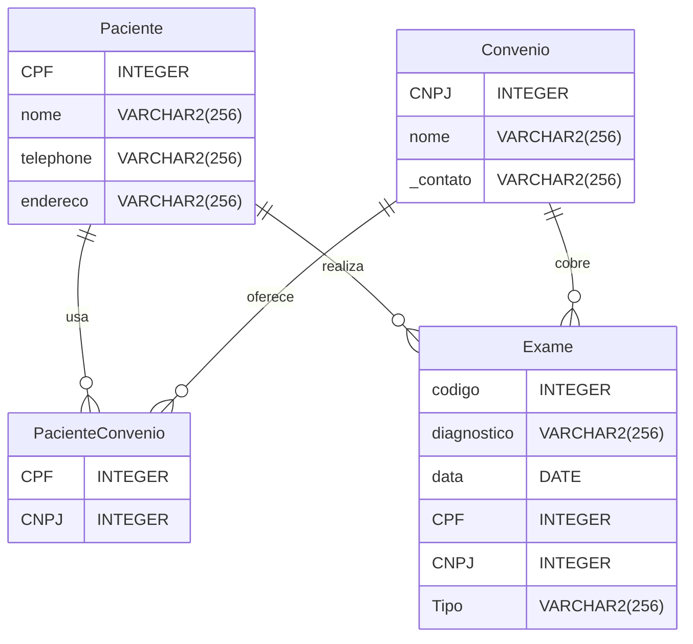

# Exercícios de Fixação — SQL (Clínica Médica)

> Conhecimento destilado do gabarito SQL: schema relacional, DML e consultas.

## Schema do banco (clínica médica)



## Conceitos exercitados

| Conceito | Ocorrências | Exemplo |
|---|---|---|
| INNER JOIN | 1 | `SELECT A.NUSP, A.NOME, D.NOME, M.ANO, M.NOTA, P.NOME, L.nome\_lab FROM ALUNO A I...` |
| LEFT OUTER | 1 | `SELECT D.Sigla, D.Nome FROM Disciplina D LEFT OUTER JOIN MATRICULA M ON D.sigla ...` |
| FULL OUTER | 1 | `SELECT T.SIGLA, L.id\_lab, L.NOME\_LAB FROM TURMA T FULL OUTER JOIN LABORATORIO ...` |
| JOIN | 4 | `SELECT T.SIGLA, L.id\_lab, L.NOME\_LAB FROM TURMA T FULL OUTER JOIN LABORATORIO ...` |
| GROUP BY | 2 | `SELECT L.nome\_lab, SUM(T.NAlunos) FROM LABORATORIO L JOIN TURMA T ON L.id\_lab ...` |
| ORDER BY | 2 | `SELECT L.nome\_lab, SUM(T.NAlunos) FROM LABORATORIO L JOIN TURMA T ON L.id\_lab ...` |
| WHERE | 3 | `SELECT D.Sigla, D.Nome FROM Disciplina D LEFT OUTER JOIN MATRICULA M ON D.sigla ...` |
| UNION | 1 | `SELECT 'aluno', COUNT(\*) FROM ALUNO UNION SELECT 'PROFESSOR', COUNT(\*) FROM PR...` |
| SUBQUERY | 0 | `-` |
| COUNT | 1 | `SELECT 'aluno', COUNT(\*) FROM ALUNO UNION SELECT 'PROFESSOR', COUNT(\*) FROM PR...` |

## Consultas de exemplo

```sql
SELECT 'aluno', COUNT(\*) FROM ALUNO UNION SELECT 'PROFESSOR', COUNT(\*) FROM PROFESSOR UNION SELECT 'Disciplina', COUNT(\*) FROM Disciplina UNION SELECT 'Turma', COUNT(\*) FROM Turma UNION SELECT 'Matricula', COUNT(\*) FROM Matricula;
```

```sql
SELECT T.SIGLA, L.id\_lab, L.NOME\_LAB FROM TURMA T FULL OUTER JOIN LABORATORIO L ON t.laboratorio \= L.id\_lab;
```

```sql
SELECT L.nome\_lab, SUM(T.NAlunos) FROM LABORATORIO L JOIN TURMA T ON L.id\_lab \= T.laboratorio GROUP BY nome\_lab ORDER BY SUM(T.NAlunos) DESC;
```

```sql
SELECT A.NUSP, A.NOME, D.NOME, M.ANO, M.NOTA, P.NOME, L.nome\_lab FROM ALUNO A INNER JOIN MATRICULA M ON M.aluno \= A.NUSP INNER JOIN TURMA T ON T.SIGLA \= M.SIGLA and T.numero \= M.NUMERO INNER JOIN LABORATORIO L ON T.laboratorio \= L.id\_lab INNER JOIN DISCIPLINA D ON T.SIGLA \= D.SIGLA INNER JOIN PROFESSOR P ON P.NFUNC \= D.PROFESSOR ORDER BY A.NOME;
```

```sql
SELECT D.Sigla, D.Nome FROM Disciplina D LEFT OUTER JOIN MATRICULA M ON D.sigla \= M.sigla WHERE M.aluno is null;
```

```sql
SELECT D.Sigla, D.Nome FROM Disciplina D WHERE NOT EXISTS (SELECT NULL FROM MATRICULA M WHERE D.sigla \= M.sigla) | | :---- | **19\)** Usando consulta aninhada não-correlacionada (IN) | SELECT D.Sigla, D.Nome FROM Disciplina D where D.Sigla NOT IN (select M.Sigla from Matricula M) | | :---- | Em uma conexão MongoDB **20\)** Crie uma coleção denominada Universidade;
```

```sql
SELECT DISTINCT A.nome as NomeAluno, P.Nome as NomeProfessor FROM Aluno A, Matricula M, Disciplina D, Professor P WHERE A.Nusp \= M.Aluno AND M.Sigla \= D.Sigla AND D.Professor \= P.NFunc **25\)** Considere o esquema visto em aula: ![][image2] Indique a consulta capaz de retornar a média de idade dos alunos que cursam/cursaram cada disciplina: a) SELECT M.Sigla, AVG(A.Idade) FROM Aluno A, Matricula M WHERE A.Nusp \= M.Aluno GROUP BY M.Sigla b) SELECT M.Sigla, SUM(A.Idade)/SUM(T.NAlunos) FROM Aluno A, Matricula M, Turma T WHERE A.Nusp \= M.Aluno AND M.Sigla \= T.Sigla AND M.Numero \= T.Numero GROUP BY M.Sigla c) SELECT T.Sigla, AVG(A.Idade) FROM Aluno A, Turma T WHERE A.Idade \= T.NAlunos GROUP BY T.Sigla d) SELECT M.Sigla, AVG(2021 \- M.Ano) FROM Matricula M, Turma T WHERE M.Sigla \= T.Sigla AND M.Numero \= T.Numero GROUP BY M.Sigla **RESPOSTA:** a **JUSTIFICATIVA:** as demais alternativas, apesar de sintaticamente corretas, não respondem à consulta desejada. **26\)** Qual das alternativas abaixo é uma prática recomendada para aumentar a escalabilidade de um sistema MongoDB? a) Armazenar todos os dados em um único nó para simplificar o gerenciamento. b) Usar índices em todas as colunas para melhorar a performance das consultas. c) Implantar sharding para distribuir a carga de trabalho e dados entre múltiplos servidores. d) Desativar a replicação para reduzir a complexidade do sistema. **RESPOSTA:** c **JUSTIFICATIVA**: implantar sharding para distribuir a carga de trabalho e dados entre múltiplos servidores é uma das principais características do MongoDB. **27\)** Graças às características BASE (Basic Availability, Soft state, Eventual consistency) do MongoDB, pode-se afirmar que: a) MongoDB garante transações com isolamento e durabilidade imediata. b) MongoDB oferece consistência imediata e integridade referencial forte. c) MongoDB é projetado para ser altamente disponível, permite estados intermediários e eventualmente atinge consistência. d) MongoDB utiliza bloqueios de nível de linha para garantir a consistência transacional. **RESPOSTA:** c **JUSTIFICATIVA**: MongoDB é projetado para ser altamente disponível, permite estados intermediários e eventualmente atinge consistência, isto é obtido por meio de replicação e dados orientados a documentos. **28\)** Qual das seguintes alternativas é uma vantagem decorrente do uso de um Sistema de Gerenciamento de Banco de Dados Relacional (SGBD)? a) Menor consumo de recursos computacionais devido à falta de integridade referencial. b) Incapacidade de escalar verticalmente. c) Suporte robusto para transações ACID, garantindo confiabilidade e integridade dos dados. d) Maior complexidade em consultas devido à ausência de uma linguagem de consulta estruturada. **RESPOSTA:** c **JUSTIFICATIVA:** SGBDs necessitam de recursos computacionais robustos;
```
