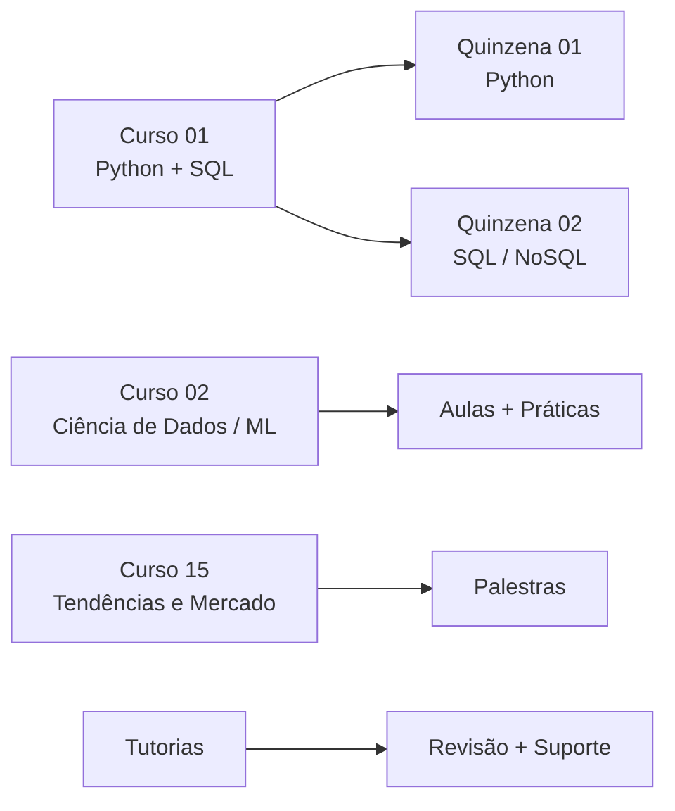

# MBA em Inteligência Artificial e Big Data — Turma 6

**ICMC/USP — PRCEU.** Hub de estudos com resumos didáticos de todas as aulas, exercícios destilados e agenda de atividades.

## Como usar

- **Sidebar à esquerda** navega por: aulas de Python, SQL/NoSQL, tutorias, exercícios e palestras.
- Cada item abre um **resumo didático** (conceitos em ordem, exemplos, armadilhas) — leia em vez de assistir a aula.
- **Tema escuro** com diagramas Mermaid nos exercícios.

## Estrutura do curso

## Próximas atividades síncronas

- **15/08/2026 09:00** — Curso 02 - Tutoria com Prof. Ricardo
- **19/08/2026 19:00** — Curso 01 - Tutoria
- **19/08/2026 20:00** — Curso 02 - Tutoria
- **22/08/2026 09:00** — Curso 02 - Tutoria
- **24/08/2026 14:00** — Curso 15 - Palestra
- **24/08/2026 19:00** — Tutoria - Como funciona os TCCs e acompanhamento
- **26/08/2026 19:00** — Curso 02 - Tutoria
- **29/08/2026 09:00** — Curso 02 - Tutoria com Prof. Ricardo
- **02/09/2026 19:00** — Curso 02 - Tutoria
- **05/09/2026 09:00** — Curso 02 - Tutoria

## Conteúdo disponível

| Seção | O que tem |
|---|---|
| 🐍 Python | 23 aulas (tipos, listas, funções, numpy, pandas) |
| 🗄️ SQL/NoSQL | 16 aulas (modelo relacional, Oracle, MongoDB) |
| 🧑‍🏫 Tutorias | 15 sessões de revisão e suporte |
| ✏️ Exercícios | Fixação Python + SQL destilados |
| 🎤 Palestras | 13 palestras destiladas |
