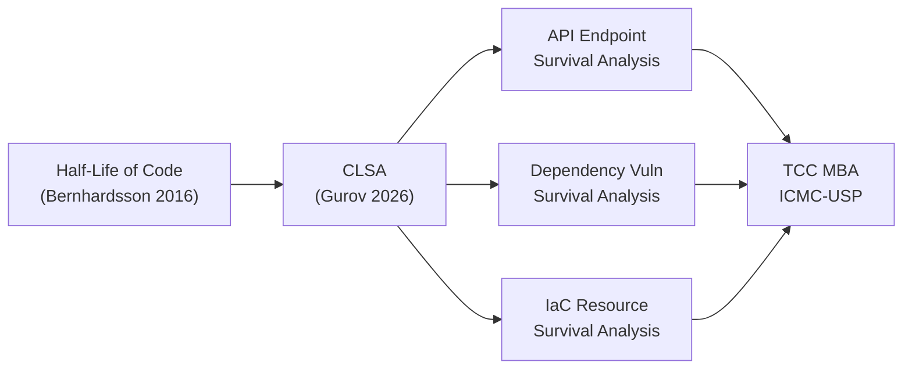

# 🎓 TCC MBA ICMC-USP: Análise de Sobrevivência de Código

## Half-Life of Code — Da Ideia à Tese

  

11.5

Anos de Dados

  

108K

Endpoints

  

2,529

APIs

  

3

Propostas

  

0

Papers Existentes (Gap)

---

## O Problema

Em 2016, Erik Bernhardsson publicou *"The half-life of code & the ship of Theseus"*, mostrando que código-fonte tem meia-vida mensurável (~3.33 anos em média). A pergunta que ficou sem resposta: **e se aplicarmos análise de sobrevivência a artefatos de mais alto nível — APIs, schemas, dependências, infraestrutura como código?**

Em 2026, Pavel Gurov formalizou o **CLSA** (Code Lifespan Survival Analysis), aplicando Cox Proportional Hazards a 32.5 milhões de linhas de código TypeScript. Mas o CLSA é **line-level**. O gap para **macro-artefatos** permanece completamente inexplorado.

---

## Estrutura do Site

| Seção | Conteúdo |
|-------|----------|
| 📜 **Artigos Fundamentais** | Papers que formam a base teórica |
| 🎯 **Propostas de Tese** | 3 propostas detalhadas com viabilidade |
| 🔬 **Metodologia** | Survival analysis, Cox PH, pipeline |
| 📊 **Datasets** | Fontes de dados verificadas |
| 🛠️ **Implementação** | Plano de execução e cronograma |
| 📈 **Comparação** | Matriz comparativa e recomendação |

---

## Navegação

Use a **barra lateral** (esquerda) para navegar entre seções. Clique em **📊 Grafo Relacional** para abrir o grafo interativo de relações entre conteúdos. Arraste os nós para reorganizar.

> **Dica:** O grafo relacional mostra conexões entre artigos, propostas, datasets e metodologia. Clique em qualquer nó para navegar diretamente ao conteúdo.