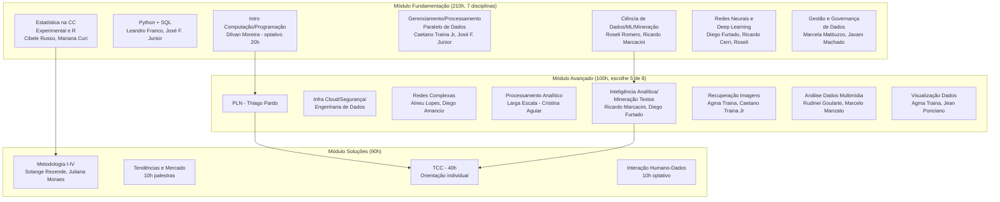

# 📚 Ementa do MBA — IA e Big Data (ICMC/USP)

Fonte oficial: [mba.iabigdata.icmc.usp.br](https://mba.iabigdata.icmc.usp.br) · [Edital 01/2026](https://adusp.org.br/files/Editais/Edital-2026-01.pdf)

## Estrutura Curricular (Edital 01/2026, 6ª Edição)

Carga horária: 450h (400 obrigatórias + 30 optativas). 100% online. 15 meses.

---

## Alinhamento com o TCC de API Endpoint Survival

| Disciplina do MBA | Conexão com o TCC |
|-------------------|-------------------|
| **Estatística (Cibele Russo, Mariana Curi)** | Cox PH, Kaplan-Meier, Schoenfeld residuals — extensão natural |
| **Ciência de Dados/ML (Roseli Romero, Ricardo Marcacini)** | Random Survival Forests, feature importance, pipeline ML |
| **Gestão de Dados (Javam Machado, Marcela Mattiuzzo)** | API governance, deprecation policies, data contracts |
| **Processamento Paralelo (Caetano Traina Jr)** | 108K endpoints, 11.5 anos git history = Big Data |
| **Python + SQL (Leandro Franco, José F. Junior)** | Stack do TCC: PyDriller, lifelines, pandas, SQLite |
| **Metodologia (Solange Rezende)** | TCC tradicional "investigação de tema emergente" |

---

## Professores Relevantes

### Cibele Maria Russo
- Profa Associada ICMC, Livre-docente 2025
- Doutora em Estatística USP (2010)
- Linhas: modelos de regressão, efeitos mistos, diagnóstico
- **Expertise transferível para Cox PH/frailty models**
- Google Scholar: 600+ citações, h=11

### Mariana Cúri
- Disciplina: Estatística na CC Experimental e R (com Cibele Russo)
- Linhas: mineração estatística de dados
- Coautora com Diego Minatel e Alneu Lopes

### Ricardo Marcondes Marcacini
- Orientador de TCC (Victor Tornisiello — LLMs)
- Coautor frequente de Solange Rezende
- Linhas: NLP, LLMs, text mining, graph learning

### Cristina Dutra de Aguiar
- Disciplina: Processamento Analítico de Larga Escala
- Orientadora de TCC (Felipe Casali — Regressão Logística)
- **Precedente: orientou TCC com ML clássico (não-DL)**

### Solange Oliveira Rezende (Coordenadora)
- Profa Titular ICMC, pós-doc University of Minnesota
- Linhas: KDD, text mining, graph learning, multimodal AI
- **Potencial orientadora se TCC enquadrado como KDD**
- Livro "Sistemas Inteligentes" (1188 citações)

---

## Perfil da Banca (Inferido)

| Característica | Evidência |
|----------------|-----------|
| Valoriza aplicação a problema real | Todos os 11 TCCs são aplicados |
| Aceita ML clássico (não-DL) | Felipe Casali — Regressão Logística |
| Exige resultados quantitativos | Acurácia, precisão, F1, retorno |
| Valoriza pipeline completo | Victor — 4 etapas; João — Grad-CAM |
| Dataset público preferido | Todos os TCCs usam dados públicos |
| Potencial de publicação é diferencial | João Vitor — deve ser publicado |
| Código público valorizado | Victor — GitHub; padrão do programa |