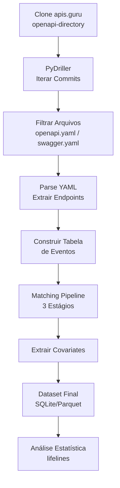

# 🔬 Pipeline de Coleta de Dados

## Visão Geral



---

## Etapa 1: Extração de Endpoints

### Script de Coleta (Python)

```python
from pydriller import Repository
import yaml
import hashlib
from pathlib import Path

def extract_endpoints(spec_content, spec_version):
    """Extrai todos os endpoints (path + method) de uma spec OpenAPI."""
    spec = yaml.safe_load(spec_content)
    endpoints = []
    paths = spec.get('paths', {})

    for path, methods in paths.items():
        for method in ['get', 'post', 'put', 'delete', 'patch', 'options', 'head']:
            if method in methods:
                operation = methods[method]
                endpoint = {
                    'path': path,
                    'method': method.upper(),
                    'operation_id': operation.get('operationId', ''),
                    'deprecated': operation.get('deprecated', False),
                    'parameters': len(operation.get('parameters', [])),
                    'has_request_body': 'requestBody' in operation,
                    'security': len(operation.get('security', [])) > 0,
                    'responses': len(operation.get('responses', {})),
                }
                endpoints.append(endpoint)
    return endpoints

def mine_repository(repo_path):
    """Minera histórico git do repositório apis.guru."""
    events = []

    for commit in Repository(repo_path).traverse_commits():
        for modified_file in commit.modified_files:
            if modified_file.filename.endswith(('openapi.yaml', 'swagger.yaml')):
                # Endpoints no source_code (após commit)
                if modified_file.source_code:
                    endpoints = extract_endpoints(
                        modified_file.source_code,
                        '3.x' if 'openapi' in modified_file.filename else '2.0'
                    )
                    for ep in endpoints:
                        ep['commit_sha'] = commit.hash
                        ep['commit_date'] = commit.author_date
                        ep['api_name'] = str(Path(modified_file.filename).parent)
                        events.append(ep)
    return events
```

---

## Etapa 2: Matching Pipeline

### Algoritmo de Matching

```python
from Levenshtein import distance as levenshtein

def match_endpoints(prev_endpoints, curr_endpoints, threshold=0.3):
    """
    Estágio 1: Exact path+method match
    Estágio 2: Path similarity (Levenshtein)
    Estágio 3: Unmatched → True Death (or Migration)
    """
    matched = []
    unmatched_prev = list(prev_endpoints)
    unmatched_curr = list(curr_endpoints)

    # Estágio 1: Exact match
    for prev in prev_endpoints[:]:
        for curr in curr_endpoints[:]:
            if (prev['path'] == curr['path'] and
                prev['method'] == curr['method']):
                matched.append({
                    'type': 'migration' if prev['api_name'] != curr['api_name'] else 'survival',
                    'prev': prev, 'curr': curr
                })
                unmatched_prev.remove(prev)
                unmatched_curr.remove(curr)
                break

    # Estágio 2: Similarity match
    for prev in unmatched_prev[:]:
        best_sim = 0
        best_curr = None
        for curr in unmatched_curr[:]:
            if prev['method'] == curr['method']:
                max_len = max(len(prev['path']), len(curr['path']))
                sim = 1 - levenshtein(prev['path'], curr['path']) / max_len
                if sim > best_sim:
                    best_sim = sim
                    best_curr = curr
        if best_sim >= (1 - threshold) and best_curr:
            matched.append({
                'type': 'modification',
                'prev': prev, 'curr': best_curr,
                'similarity': best_sim
            })
            unmatched_prev.remove(prev)
            unmatched_curr.remove(best_curr)

    # Estágio 3: Unmatched → True Death (prev) / Birth (curr)
    deaths = [{'type': 'true_death', 'endpoint': ep} for ep in unmatched_prev]
    births = [{'type': 'birth', 'endpoint': ep} for ep in unmatched_curr]

    return matched, deaths, births
```

---

## Etapa 3: Construção da Tabela de Eventos

### Estrutura Final

```sql
CREATE TABLE events (
    endpoint_id TEXT PRIMARY KEY,
    api_name TEXT,
    path TEXT,
    method TEXT,
    birth_commit TEXT,
    birth_date TIMESTAMP,
    death_commit TEXT,
    death_date TIMESTAMP,
    duration_days REAL,
    event_observed INTEGER,  -- 1 = morreu, 0 = censored
    -- Covariates
    path_depth INTEGER,
    param_count INTEGER,
    response_count INTEGER,
    has_deprecation INTEGER,
    provider_category TEXT,
    spec_version TEXT,
    has_security INTEGER,
    api_age_at_birth REAL,
    sibling_count INTEGER,
    has_request_body INTEGER
);
```

---

## Etapa 4: Classificação de Providers

### Categorias

| Categoria | Exemplos | Critério |
|-----------|----------|----------|
| **financial** | Stripe, Plaid, PayPal, Open Banking APIs | Fintech, banking, payments |
| **social** | Twitter, Facebook, Instagram, LinkedIn | Redes sociais |
| **cloud** | AWS, GCP, Azure, DigitalOcean | Cloud providers |
| **utility** | SendGrid, Twilio, Slack, GitHub | Developer tools, communication |
| **other** | Demais APIs | Fallback |

### Método

1. **Automático:** GitHub topics, descrição da API, tags no apis.guru
2. **Manual:** Revisão de amostra para validar classificação automática
3. **Consenso:** Múltiplos classificadores (inter-rater reliability)