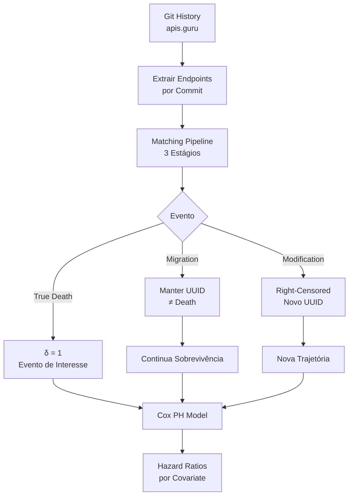

# ❓ Pergunta de Pesquisa

## Questão Central

> **Como modelar e prever a sobrevivência de artefatos de software em nível macro (APIs, dependências, infraestrutura) utilizando análise de sobrevivência (Cox Proportional Hazards), e quais fatores estruturais, contextuais e organizacionais influenciam o tempo de vida desses artefatos?**

## Sub-Questões

### RQ1: Baseline de Sobrevivência
Qual é a distribuição de sobrevivência (Kaplan-Meier) dos artefatos? Qual a mediana de vida? Qual a proporção de artefatos que nunca são removidos (censoring)?

### RQ2: Fatores de Risco
Quais covariates estruturais (ex: HTTP method, path depth, CVE severity, resource type) têm efeito significativo no hazard de remoção?

### RQ3: Efeito de Repositório/Provider
O identity do repositório ou provider é o fator dominante (gamma frailty), como observado no CLSA?

### RQ4: Efeitos Time-Varying
Os efeitos das covariates variam ao longo do tempo? Existem diferentes "regimes" de risco (early-life vs mature vs legacy)?

### RQ5: Comparação entre Ecossistemas
Artefatos em diferentes ecossistemas (APIs financeiras vs sociais, dependências Maven vs npm, recursos AWS vs GCP) têm perfis de sobrevivência distintos?

## Hipóteses (Proposta 1 — API Endpoint Survival)

| H# | Hipótese | Direção Esperada | Covariate |
|----|----------|-----------------|-----------|
| H1 | POST endpoints têm hazard > GET | HR > 1 | HTTP method |
| H2 | Deprecation marker → maior hazard | HR > 1 | Has deprecation |
| H3 | APIs financeiras > longevidade | HR < 1 | Provider category |
| H4 | Path depth maior → maior hazard | HR > 1 | Path depth |
| H5 | Provider identity é maior fator | theta > 1 | Gamma frailty |
| H6 | Spec 3.x endpoints > longevidade que 2.0 | HR < 1 | Spec version |
| H7 | Endpoints com security scheme > longevidade | HR < 1 | Has security |

## Framework Conceitual

