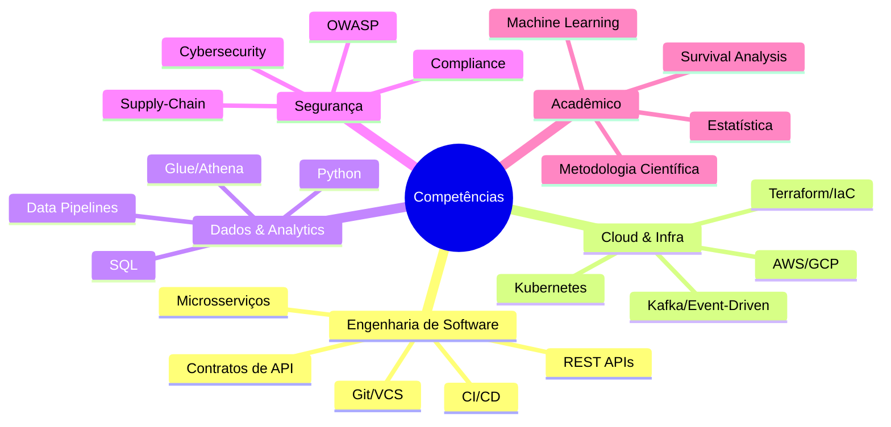

# 👤 Background do Candidato

## Perfil Profissional

| Dimensão | Detalhe |
|----------|---------|
| **Cargo atual** | Engenheiro de Software Backend Sênior |
| **Experiência** | 5 anos |
| **Domínio** | Sistemas financeiros de volumetria extremamente alta e alta criticidade |
| **Stack** | Sistemas distribuídos em cloud pública (AWS/GCP) |
| **Formação** | Cybersecurity (graduação concluída) |
| **Formação prévia** | Bacharelado em Ciência e Tecnologia — UFABC (drop-off) |
| **MBA atual** | IA e Big Data — ICMC/USP (2026) |

## Competências Relevantes para o TCC

## Por que Este Tema?

1. **Conexão direta com rotina diária:** REST APIs, microsserviços, contratos, versionamento e depreciação de APIs são atividades cotidianas em sistemas financeiros
2. **Background em cybersecurity:** complementa ângulos de supply-chain, vulnerabilidades e segurança de dependências
3. **Experiência com Git e VCS:** mineração de repositórios é habilidade já dominada
4. **MBA em IA e Big Data:** survival analysis é técnica estatística avançada que se enquadra perfeitamente no escopo do curso
5. **ICMC-USP:** corpo docente inclui especialistas em análise de sobrevivência (Cibele Russo, Mariana Curi)

## Alinhamento Tema ↔ Perfil

| Ângulo de TCC | Alinhamento | Justificativa |
|---------------|-------------|---------------|
| API Endpoint Survival | ⭐⭐⭐⭐⭐ | REST APIs, contratos, microsserviços — rotina diária |
| Dependency Vuln Survival | ⭐⭐⭐⭐⭐ | Cybersecurity, supply-chain, segurança de aplicações |
| IaC Resource Survival | ⭐⭐⭐⭐ | Terraform, cloud pública, infraestrutura como código |
| Schema Evolution Survival | ⭐⭐⭐⭐ | Kafka, Avro/Protobuf, event-driven |
