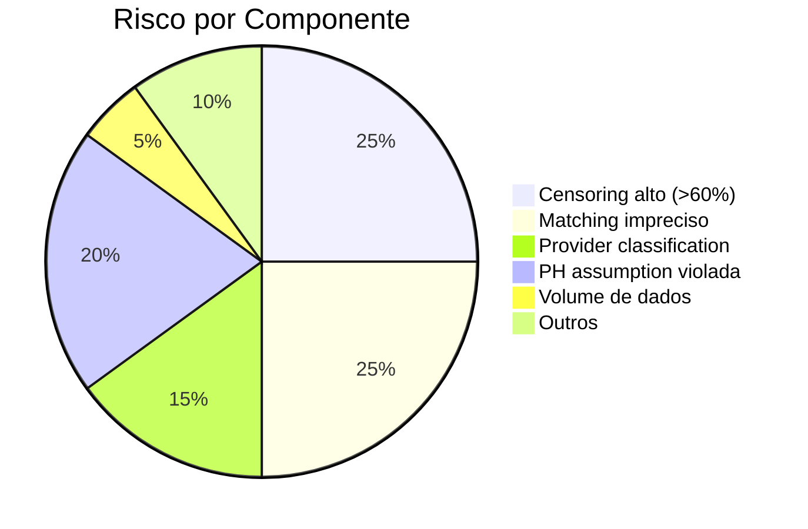
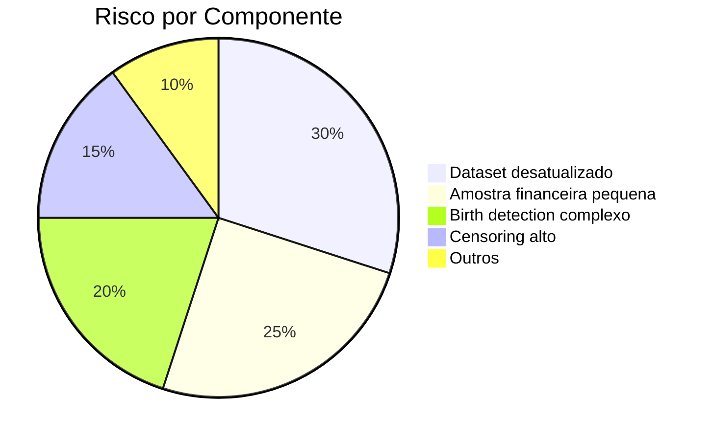
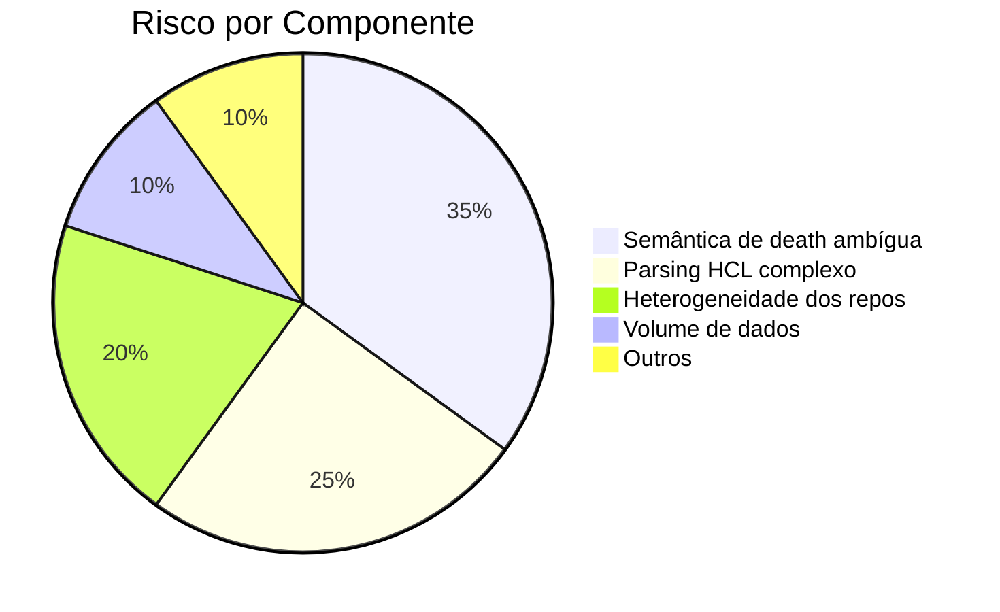

# 📈 Matriz Comparativa

## Comparação das 3 Propostas

| Dimensão | Proposta 1: API Endpoint | Proposta 2: Dependency Vuln | Proposta 3: IaC Resource |
|----------|--------------------------|----------------------------|--------------------------|
| **Gap (papers existentes)** | ZERO | ZERO | ZERO |
| **Dataset** | apis.guru (108K, 11.5 anos) | CVEfixes (5,365, até 2021) | Terraform repos (68K+) |
| **Maturidade do dataset** | ⭐⭐⭐⭐⭐ | ⭐⭐⭐ | ⭐⭐ |
| **Volume de eventos** | ⭐⭐⭐⭐⭐ | ⭐⭐⭐ | ⭐⭐⭐⭐ |
| **Facilidade de parsing** | ⭐⭐⭐⭐⭐ (YAML) | ⭐⭐⭐⭐ (git) | ⭐⭐ (HCL) |
| **Clareza semântica** | ⭐⭐⭐⭐⭐ | ⭐⭐⭐⭐ | ⭐⭐ |
| **Alinhamento perfil** | ⭐⭐⭐⭐⭐ | ⭐⭐⭐⭐⭐ | ⭐⭐⭐⭐ |
| **Alinhamento MBA** | ⭐⭐⭐⭐ | ⭐⭐⭐⭐ | ⭐⭐⭐ |
| **Complexidade** | Média | Média | Alta |
| **Risco de implementação** | Baixo | Médio | Alto |
| **Relevância prática** | ⭐⭐⭐⭐⭐ | ⭐⭐⭐⭐⭐ | ⭐⭐⭐ |
| **Originalidade** | ⭐⭐⭐⭐⭐ | ⭐⭐⭐⭐ | ⭐⭐⭐⭐ |

---

## Análise de Risco

### Proposta 1: API Endpoint Survival

**Risco geral: BAIXO.** Censoring e PH violation são conhecidos e têm mitigação (CLSA já enfrentou ambos). Matching e classification são calibráveis.

### Proposta 2: Dependency Vulnerability Survival

**Risco geral: MÉDIO.** Dataset precisa de atualização significativa. Filtro "financial" pode reduzir amostra. Birth detection (git blame para versão de dependência) é mais complexo que endpoint birth.

### Proposta 3: IaC Resource Survival

**Risco geral: ALTO.** A ambiguidade semântica de "morte" de recurso IaC é o maior problema. Parsing HCL é significativamente mais complexo que YAML.

---

## Radar de Decisão

```mermaid
graph TD
    subgraph "Proposta 1 ⭐"
        A1[Gap: 5/5] --- A2[Dataset: 5/5]
        A2 --- A3[Alinhamento: 5/5]
        A3 --- A4[Viabilidade: 5/5]
        A4 --- A5[Risco: Baixo]
        A5 --- A6[Relevância: 5/5]
    end

    subgraph "Proposta 2 🔄"
        B1[Gap: 5/5] --- B2[Dataset: 3/5]
        B2 --- B3[Alinhamento: 5/5]
        B3 --- B4[Viabilidade: 4/5]
        B4 --- B5[Risco: Médio]
        B5 --- B6[Relevância: 5/5]
    end

    subgraph "Proposta 3 🔧"
        C1[Gap: 5/5] --- C2[Dataset: 3/5]
        C2 --- C3[Alinhamento: 4/5]
        C3 --- C4[Viabilidade: 3/5]
        C4 --- C5[Risco: Alto]
        C5 --- C6[Relevância: 3/5]
    end
```

---

## Pontuação Ponderada

| Critério | Peso | P1: API | P2: Vuln | P3: IaC |
|----------|------|---------|----------|---------|
| Gap de pesquisa | 25% | 5 (1.25) | 5 (1.25) | 5 (1.25) |
| Dataset | 20% | 5 (1.00) | 3 (0.60) | 3 (0.60) |
| Alinhamento perfil | 20% | 5 (1.00) | 5 (1.00) | 4 (0.80) |
| Viabilidade | 15% | 5 (0.75) | 4 (0.60) | 3 (0.45) |
| Risco | 10% | 4 (0.40) | 3 (0.30) | 2 (0.20) |
| Relevância | 10% | 5 (0.50) | 5 (0.50) | 3 (0.30) |
| **TOTAL** | **100%** | **4.90** | **4.25** | **3.60** |
