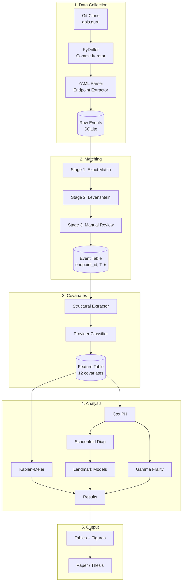

# 🛠️ Pipeline Detalhado (Proposta 1)

## Arquitetura do Sistema



---

## Estrutura de Diretórios do Projeto

```
tcc-api-survival/
├── data/
│   ├── raw/                    # Dados brutos
│   │   ├── events_raw.parquet
│   │   └── endpoints_by_commit.parquet
│   ├── processed/              # Dados processados
│   │   ├── event_table.parquet
│   │   └── feature_table.parquet
│   └── external/               # Dados externos
│       ├── provider_categories.csv
│       └── api_metadata.csv
├── notebooks/
│   ├── 01_explore_dataset.ipynb
│   ├── 02_km_analysis.ipynb
│   ├── 03_cox_ph.ipynb
│   └── 04_results_viz.ipynb
├── src/
│   ├── collect.py              # Coleta de dados (PyDriller)
│   ├── extract.py              # Extração de endpoints
│   ├── match.py                # Matching pipeline
│   ├── features.py             # Extração de covariates
│   ├── classify.py             # Classificação de providers
│   ├── survival.py             # Análise de sobrevivência
│   └── viz.py                  # Visualização
├── tests/
│   ├── test_match.py
│   └── test_features.py
├── output/
│   ├── figures/                # Gráficos para o paper
│   └── tables/                 # Tabelas formatadas
├── paper/
│   └── tcc.tex                 # Paper final
├── requirements.txt
├── Makefile
└── README.md
```

---

## Makefile

```makefile
.PHONY: all collect match features analyze paper clean

all: collect match features analyze

collect:
	python src/collect.py --repo ../openapi-directory --output data/raw/

match:
	python src/match.py --input data/raw/ --output data/processed/event_table.parquet

features:
	python src/features.py --events data/processed/event_table.parquet --output data/processed/feature_table.parquet

analyze:
	jupyter nbconvert --to notebook --execute notebooks/02_km_analysis.ipynb
	jupyter nbconvert --to notebook --execute notebooks/03_cox_ph.ipynb

paper:
	cd paper && pdflatex tcc.tex && bibtex tcc && pdflatex tcc.tex && pdflatex tcc.tex

clean:
	rm -rf data/processed/* output/figures/* output/tables/*
```

---

## Dependências (requirements.txt)

```
lifelines>=0.28.0
scikit-survival>=0.22.0
pydriller>=2.5
pyyaml>=6.0
pandas>=2.0
numpy>=1.24
python-Levenshtein>=0.21
matplotlib>=3.7
seaborn>=0.12
statsmodels>=0.14
jupyter>=1.0
pytest>=7.0
```

---

## Script Principal (collect.py)

```python
"""Coleta de dados do apis.guru/openapi-directory."""
import argparse
from pathlib import Path
from pydriller import Repository
import yaml
import pandas as pd
from tqdm import tqdm

def main(repo_path, output_dir):
    events = []
    repo = Repository(str(repo_path))

    for commit in tqdm(repo.traverse_commits(), desc="Processing commits"):
        for file in commit.modified_files:
            if not file.filename.endswith(('openapi.yaml', 'swagger.yaml')):
                continue
            if not file.source_code:
                continue

            api_name = str(Path(file.filename).parent)
            spec = yaml.safe_load(file.source_code)
            paths = spec.get('paths', {})

            for path, methods in paths.items():
                for method in ['get', 'post', 'put', 'delete', 'patch']:
                    if method not in methods:
                        continue
                    op = methods[method]
                    events.append({
                        'commit_sha': commit.hash,
                        'commit_date': commit.author_date,
                        'api_name': api_name,
                        'path': path,
                        'method': method.upper(),
                        'operation_id': op.get('operationId', ''),
                        'deprecated': op.get('deprecated', False),
                        'param_count': len(op.get('parameters', [])),
                        'has_body': 'requestBody' in op,
                        'has_security': bool(op.get('security')),
                        'response_count': len(op.get('responses', {})),
                    })

    df = pd.DataFrame(events)
    output = Path(output_dir) / 'endpoints_by_commit.parquet'
    df.to_parquet(output)
    print(f"Saved {len(df)} endpoint-commit pairs to {output}")

if __name__ == '__main__':
    parser = argparse.ArgumentParser()
    parser.add_argument('--repo', required=True)
    parser.add_argument('--output', required=True)
    args = parser.parse_args()
    main(args.repo, args.output)
```
