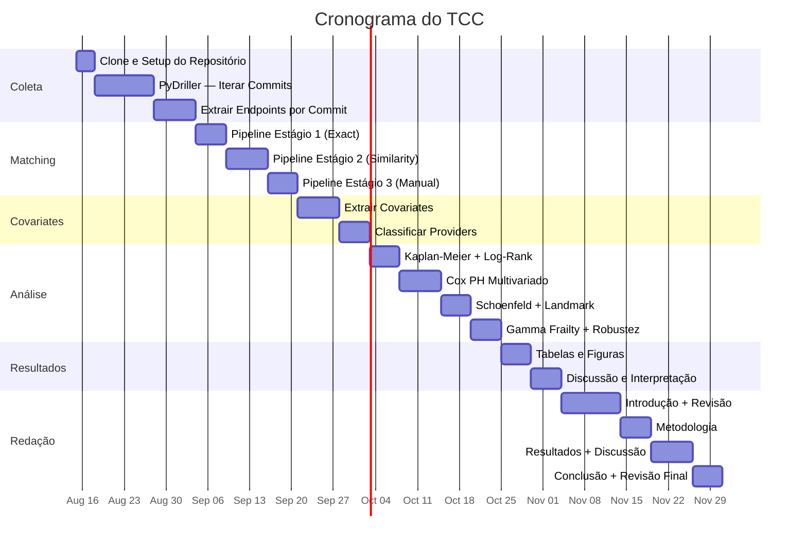

# 🛠️ Plano de Execução

## Visão Geral (6 Etapas, ~3 Meses)

---

## Detalhamento por Etapa

### Etapa 1: Coleta (2-3 semanas)

| Tarefa | Dias | Output |
|--------|------|--------|
| Clone apis.guru/openapi-directory | 1 | Repositório local (784 MB) |
| Setup ambiente Python | 1 | venv + dependências |
| PyDriller itera todos os commits | 5-7 | Lista de commits com arquivos modificados |
| Parse OpenAPI specs por commit | 5-7 | ~108K endpoints extraídos |
| Construir tabela inicial de eventos | 2-3 | CSV/Parquet com endpoint_id, commit, path, method |

### Etapa 2: Matching (2-3 semanas)

| Tarefa | Dias | Output |
|--------|------|--------|
| Implementar Exact Match (Estágio 1) | 3-5 | Endpoints matched por path+method exato |
| Implementar Similarity Match (Estágio 2) | 5-7 | Endpoints matched por Levenshtein |
| Calibrar threshold de similaridade | 2-3 | Threshold ótimo (amostra 500 endpoints) |
| Manual Review (Estágio 3) | 3-5 | 5-10% dos casos ambíguos revisados |
| Classificar eventos (Migration/Modification/True Death) | 2-3 | Tabela de eventos final |

### Etapa 3: Covariates (2 semanas)

| Tarefa | Dias | Output |
|--------|------|--------|
| Extrair path_depth, param_count, etc. | 3-5 | Covariates estruturais |
| Classificar providers (automático) | 3-5 | Categorização inicial |
| Validar classificação (manual) | 2-3 | Acurácia da classificação |

### Etapa 4: Análise Estatística (3-4 semanas)

| Tarefa | Dias | Output |
|--------|------|--------|
| Kaplan-Meier global | 2-3 | Curva S(t) global |
| KM estratificado (method, category) | 2-3 | Curvas por grupo |
| Log-rank tests + BH FDR | 1-2 | p-values ajustados |
| Cox PH fit inicial | 3-5 | Modelo multivariado |
| Schoenfeld residuals | 2-3 | Diagnóstico PH |
| Time-stratified landmark | 3-5 | 3 modelos por regime |
| Gamma frailty | 2-3 | Efeitos aleatórios |
| Robustez (Weibull AFT) | 2-3 | Validação |

### Etapa 5: Resultados (2 semanas)

| Tarefa | Dias | Output |
|--------|------|--------|
| Tabelas de HR com CI | 3-5 | Tabelas formatadas |
| Gráficos (KM, forest plot) | 2-3 | Figuras para o paper |
| Discussão dos achados | 3-5 | Interpretação |

### Etapa 6: Redação (4 semanas)

| Tarefa | Dias | Output |
|--------|------|--------|
| Introdução | 5-7 | Seção 1 |
| Revisão da Literatura | 5-7 | Seção 2 |
| Metodologia | 5-7 | Seção 3 |
| Resultados | 5-7 | Seção 4 |
| Discussão | 3-5 | Seção 5 |
| Conclusão | 2-3 | Seção 6 |
| Revisão final | 3-5 | Versão final |

---

## Total Estimado

| Fase | Semanas |
|------|---------|
| Coleta | 3 |
| Matching | 3 |
| Covariates | 2 |
| Análise | 4 |
| Resultados | 2 |
| Redação | 4 |
| **Total** | **~16 semanas (4 meses)** |

Buffer de 2 meses para imprevistos = **6 meses total**. Compatível com cronograma de TCC de MBA.
