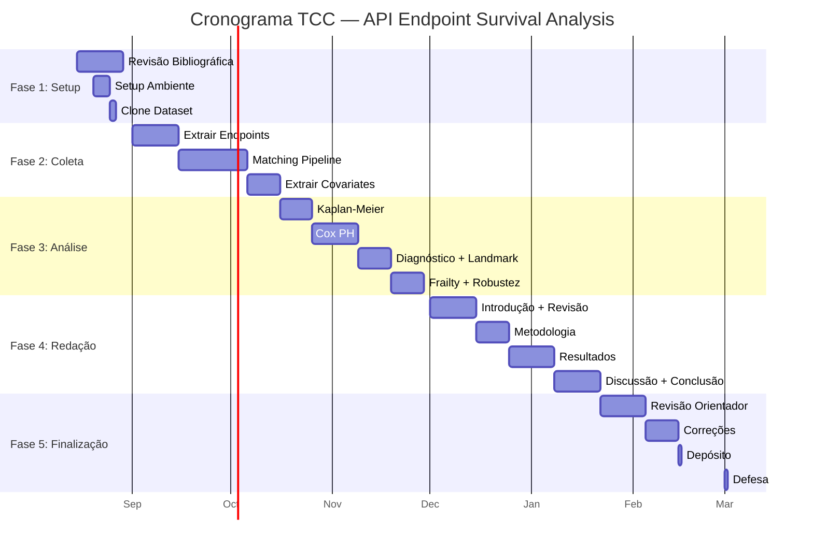

# 🛠️ Cronograma Detalhado

## Timeline (Agosto 2026 — Fevereiro 2027)

---

## Marcos (Milestones)

| Data | Marco | Entregável |
|------|-------|------------|
| **15 Ago 2026** | Início do projeto | Setup + revisão bibliográfica |
| **15 Set 2026** | Fim da coleta | Event table completa |
| **06 Out 2026** | Fim do matching | Eventos classificados (Migration/Modification/True Death) |
| **16 Out 2026** | Fim covariates | Feature table com 12 covariates |
| **30 Nov 2026** | Fim da análise | Todos os modelos rodados (KM, Cox, landmark, frailty) |
| **15 Dez 2026** | Metodologia escrita | Seção 3 do paper |
| **15 Jan 2027** | Resultados escritos | Seções 4-5 do paper |
| **05 Fev 2027** | Versão final | Paper completo revisado |
| **15 Fev 2027** | Depósito | TCC depositado |
| **Mar 2027** | Defesa | Apresentação para banca |

---

## Alocação Semanal (Horas)

| Atividade | Horas/Semana | Total Semanas | Total Horas |
|-----------|-------------|---------------|-------------|
| Revisão bibliográfica | 10 | 4 | 40 |
| Coleta + Matching | 15 | 6 | 90 |
| Covariates | 10 | 3 | 30 |
| Análise estatística | 15 | 6 | 90 |
| Redação | 15 | 8 | 120 |
| Revisão + correções | 10 | 4 | 40 |
| **Total** | | | **~410 horas** |

---

## Riscos e Mitigações

| Risco | Probabilidade | Impacto | Mitigação |
|-------|-------------|---------|-----------|
| Censoring >80% | Média | Alto | CLSA teve 66.1% — aceitável. Se >80%, aumentar janela de observação |
| Matching pipeline impreciso | Média | Alto | Validar com amostra manual (500 endpoints). Ajustar thresholds |
| Provider classification ruim | Baixa | Médio | Usar GitHub topics + APIs.guru metadata. Validar com amostra |
| PH assumption violada | Alta | Baixo | Esperado (CLSA também violou). Landmark models resolvem |
| Volume de dados > memória | Baixa | Médio | Processar em chunks. Parquet é eficiente. SQLite para consultas |
| Atraso na coleta | Média | Médio | Buffer de 2 meses no cronograma |
