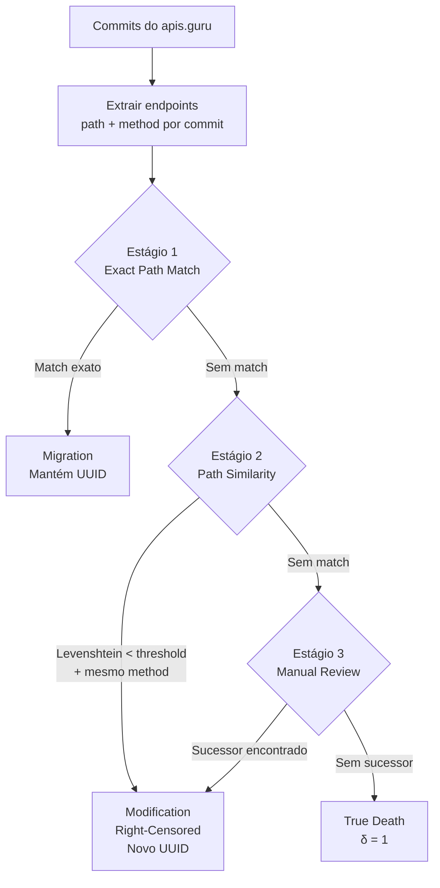
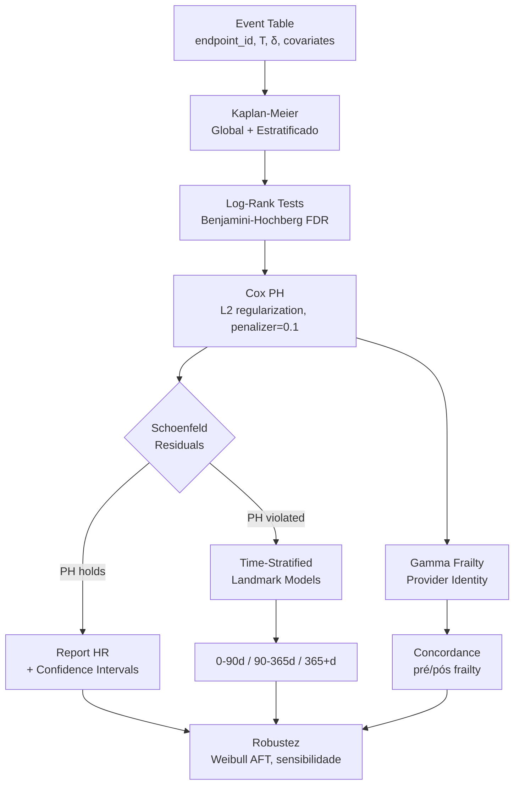

# 🎯 Proposta 1: API Endpoint Survival Analysis ⭐

  

⭐

Tese Principal

  

0

Papers Existentes

  

108K

Endpoints

  

11.5

Anos de Dados

---

## Título

> **"Survival Analysis of REST API Endpoints: A Large-Scale Empirical Study Using Cox Proportional Hazards"**

## O Quê

Aplicar análise de sobrevivência (Cox Proportional Hazards) a endpoints REST em especificações OpenAPI para modelar fatores de risco que influenciam o tempo de vida de endpoints de API.

## Por Quê

### O Gap é Real (Tripla Verificação)

1. **RADA** (Yasmin 2020): estudo **descritivo** de deprecated API elements — NÃO aplica Cox PH
2. **Lercher** (2023): entrevistas com 17 profissionais sobre estratégias de evolução — qualitativo
3. **arXiv search:** "API endpoint survival analysis" = **ZERO** resultados
4. **Google Scholar:** NENHUM paper aplica survival analysis a API endpoints/operations

### Por que Importa

- **API governance:** empresas precisam decidir quando depreciar/remover endpoints
- **Breaking changes:** impacto em aplicações downstream
- **Alocação de recursos:** quais endpoints exigem mais manutenção?
- **Compliance:** APIs financeiras têm requisitos regulatórios de estabilidade

---

## Dataset

### apis.guru/openapi-directory

| Métrica | Valor |
|---------|-------|
| APIs no diretório | **2,529** |
| Endpoints totais | **108,837** |
| Histórico git | **11.5 anos** (criado 2015-02-22) |
| Atualização | Semanal automatizada |
| Licença | CC0 (domínio público) |
| Formato | OpenAPI 2.0 / 3.x (YAML/JSON) |
| Estrutura | Cada API em subdiretório com `openapi.yaml` ou `swagger.yaml` |

### Por que Este Dataset

1. **VCS-tracked:** cada commit é um snapshot do estado dos endpoints
2. **Longa duração:** 11.5 anos de observação → suficiente para Kaplan-Meier e Cox PH
3. **Volume:** 108K endpoints → poder estatístico adequado
4. **Diversidade:** APIs de múltiplos domínios (financial, social, cloud, utility)
5. **Público:** CC0, reproduzível, sem barreiras de acesso

---

## Definição Operacional

### Eventos

| Evento | Definição | No Git |
|--------|-----------|--------|
| **Birth** | Commit onde `path + HTTP method` aparece pela primeira vez na spec | `git log --follow -- openapi.yaml` |
| **Death** | Commit onde `path + HTTP method` é permanentemente removido | Remoção da operação do spec |
| **Migration** | Endpoint muda de path mas mantém mesma operação semântica | Path renomeado, mesmo operationId |
| **Modification** | Parâmetros/response alterados mas endpoint mantido | Alteração no spec |
| **Censoring** | Último commit observado (endpoint ainda ativo) | Fim da janela de observação |

### Matching Pipeline (3 Estágios — Simplificado do CLSA)

---

## Covariates (12)

| # | Covariate | Tipo | Valores/Transformação | Hipótese |
|---|-----------|------|----------------------|----------|
| 1 | **HTTP method** | Categórica | GET, POST, PUT, DELETE, PATCH | POST > hazard que GET |
| 2 | **Path depth** | Contínua | Nº segmentos no path | +depth → +hazard |
| 3 | **Parameter count** | Contínua | query + path + header params | +params → +complexidade |
| 4 | **Response type count** | Contínua | Nº de response codes definidos | +responses → +estabilidade |
| 5 | **Has deprecation** | Binária | `deprecated: true` no spec | Depreciação → +hazard |
| 6 | **Provider category** | Categórica | financial, social, cloud, utility, other | Financial > longevidade |
| 7 | **Spec version** | Binária | Swagger 2.0 vs OpenAPI 3.x | 3.x > longevidade |
| 8 | **Has security** | Binária | security schemes definidos | Segurança → +estabilidade |
| 9 | **API age at birth** | Contínua | Dias desde primeiro commit da API | API madura → -hazard |
| 10 | **Sibling count** | Contínua | Nº endpoints na mesma API | Competição → +hazard |
| 11 | **Has request body** | Binária | requestBody presente | Complexidade → +hazard |
| 12 | **Provider identity** | Gamma frailty | Random effect por provider | Maior fator (CLSA) |

---

## Hipóteses Formais

| H# | Hipótese Nula (H₀) | Hipótese Alternativa (H₁) | Covariate |
|----|---------------------|--------------------------|-----------|
| H1 | HR_POST = 1 | HR_POST > 1 | HTTP method |
| H2 | HR_deprecated = 1 | HR_deprecated > 1 | Has deprecation |
| H3 | HR_financial = 1 | HR_financial < 1 | Provider category |
| H4 | β_path_depth = 0 | β_path_depth > 0 | Path depth |
| H5 | θ = 0 (sem frailty) | θ > 0 (frailty significativo) | Provider identity |
| H6 | HR_openapi3 = 1 | HR_openapi3 < 1 | Spec version |
| H7 | HR_security = 1 | HR_security < 1 | Has security |

---

## Pipeline Estatístico

---

## Resultados Esperados

### Kaplan-Meier

- Curva de sobrevivência global dos endpoints
- Estratificação por HTTP method, provider category, deprecation
- Mediana de sobrevivência (se alcançada)
- Taxa de censoring (esperada >60%, similar ao CLSA)

### Cox PH

- Tabela de Hazard Ratios com 95% CI para cada covariate
- Concordance index (linha de base)
- Concordance com gamma frailty (esperada melhoria similar ao CLSA: 0.59 → 0.67)

### Landmark Models

- 3 regimes temporais com covariates distintas
- Identificação de fatores que mudam de protetivos para risco ao longo do tempo

---

## Viabilidade

| Dimensão | Avaliação | Detalhe |
|----------|-----------|---------|
| **Dataset** | ✅ ALTA | Público, 11.5 anos, CC0 |
| **Ferramentas** | ✅ ALTA | lifelines + scikit-survival maduras |
| **Volume** | ✅ GERENCIÁVEL | 108K endpoints em máquina local |
| **Complexidade** | ✅ MÉDIA | YAML parsing + git mining + Cox PH |
| **Tempo** | ✅ 3-4 meses | Compatível com cronograma MBA |
| **Censoring** | ⚠️ MÉDIO | Esperado >60%, mas CLSA funcionou com 66.1% |
| **Matching** | ⚠️ MÉDIO | Path similarity requer calibração |

---

## Diferencial para Banca

1. **Gap zero** — primeiro estudo de survival analysis em API endpoints
2. **Conexão profissional** — rotina diária do candidato com REST APIs
3. **Rigor metodológico** — Cox PH + frailty + landmark + robustez
4. **Reprodutibilidade** — dataset público, código aberto
5. **Relevância prática** — API governance, políticas de deprecation
6. **Enquadramento MBA** — Big Data (108K endpoints) + IA (modelagem preditiva)
